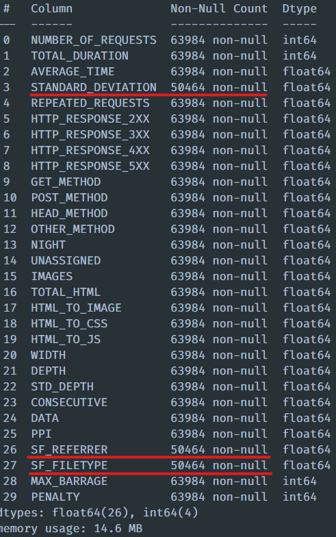

# Rapport -- Weblogs opdracht -- Floris Buyse -- G2E2
---
## Data begrijpen en cleanen
---
1. Data opsplitsen (95 / 5)
2. ID droppen
3. NaN-waarden zoeken in data
4. NaN-waarden wegkrijgen / oplossen (4 verschillende manieren getest)
5. Feature importance bekijken
6. Conclusie
---
### 1. Data opsplitsen (95 / 5)
- We gebruiken 95% voor het trainen en testen van verschillende machine learning models en de andere 5% voor het finaal model en voor hertraining van dit finaal model
    ```python
        half = int(df.shape[0] * 0.95)
        df1 = df.iloc[:half]
        df2 = df.iloc[half:]

        df1.to_csv('../data/weblogs1.csv', index=False)
        df2.to_csv('../data/weblogs2.csv', index=False)
    ```
    deze code is ook terug te vinden in ``main_scripts/split_csv.ipynb``
---
### 2. ID droppen

- ``ID heeft geen toegevoegde waarde aan de data.``
  ```python
  df = pd.read_csv('../data/weblogs1.csv')
  df = df.drop(['ID'], axis=1)
  ```
---
### 3. NaN-waaren zoeken in data

- ``We zien dat "STANDARD_DEVIATION", "SF_FILETYPE" en "SF_REFERRER" NaN-waarden hebben``

    ```python
    X = df.drop(['ROBOT'], axis=1)
    y = df['ROBOT']
    X.info()
    ```

- 

---
### 4. NaN-waarden wegkrijgen / oplossen
#### 4.1 De features opvullen met 0

- We vullen de features op met nul en vergelijken de standaard deviatie (niet de feature) met die van de 'niet-opgevulde' X

    ```python
    X_zero = X.fillna(0)
    X_zero.std()
    ```
